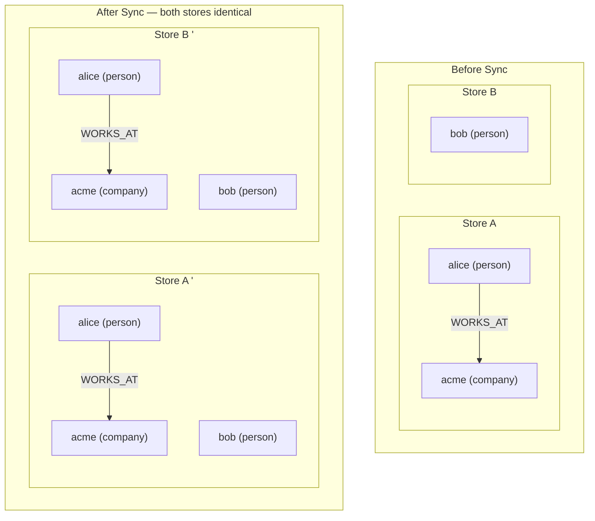
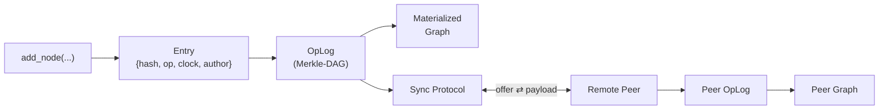

# Silk

A Merkle-CRDT graph engine for distributed, conflict-free knowledge graphs.

[](https://github.com/Kieleth/silk-graph/actions/workflows/ci.yml)
[](https://crates.io/crates/silk-graph)
[](https://pypi.org/project/silk-graph/)
[](https://github.com/Kieleth/silk-graph/blob/main/LICENSE.md)

Silk is an embedded graph database with automatic conflict resolution. Built on Merkle-DAGs and CRDTs, it requires no leader, no consensus protocol, and no coordinator. Any two Silk instances that exchange sync messages are guaranteed to converge to the same graph state. Schema is enforced at write time via an ontology — not at query time.

## Quick Start

### Python

```bash
pip install silk-graph
```

```python
from silk import GraphStore
import json

# Define your schema
ontology = json.dumps({
    "node_types": {
        "person": {"properties": {"age": {"value_type": "int"}}},
        "company": {"properties": {}}
    },
    "edge_types": {
        "WORKS_AT": {"source_types": ["person"], "target_types": ["company"], "properties": {}}
    }
})

# Create two independent stores (imagine different machines)
store_a = GraphStore("node-a", ontology)
store_b = GraphStore("node-b", ontology)

# Write to store A
store_a.add_node("alice", "person", "Alice", {"age": 30})
store_a.add_node("acme", "company", "Acme Corp")
store_a.add_edge("e1", "WORKS_AT", "alice", "acme")

# Write to store B (concurrently, no coordination)
store_b.add_node("bob", "person", "Bob", {"age": 25})

# Sync: A sends to B
offer = store_a.generate_sync_offer()
payload = store_b.receive_sync_offer(offer)
store_a.merge_sync_payload(payload)

# Sync: B sends to A
offer = store_b.generate_sync_offer()
payload = store_a.receive_sync_offer(offer)
store_b.merge_sync_payload(payload)

# Both stores now have Alice, Bob, Acme, and the WORKS_AT edge
assert store_a.get_node("alice") is not None
assert store_a.get_node("bob") is not None
assert store_b.get_node("alice") is not None
assert store_b.get_node("bob") is not None
```

### What just happened

The code above created two independent graph stores, wrote data to each, and synced them — both now hold the same graph. No server, no coordinator, no conflict resolution code. Here's what it looks like:



Under the hood, every write becomes a content-addressed entry in a Merkle-DAG. Sync exchanges only the entries the other side is missing:



### Rust

```rust
use silk::{GraphStore, Ontology};

let ontology = Ontology::from_json(schema_json)?;
let mut store = GraphStore::new("node-1", ontology);

store.add_node("alice", "person", "Alice", Some(props))?;
store.add_edge("e1", "WORKS_AT", "alice", "acme", None)?;

// Sync with a peer
let offer = store.generate_sync_offer();
let payload = peer.receive_sync_offer(&offer)?;
store.merge_sync_payload(&payload)?;
```

## Features

- **Ontology-enforced schema** — define node types, edge types, and their properties. Silk validates at write time. Invalid entries from sync are quarantined (R-02) — accepted into the oplog for CRDT convergence but invisible in the materialized graph. Unknown properties and subtypes are accepted (D-026: open properties) — the ontology defines the minimum, not the maximum.
- **Content-addressed entries** — every mutation is a BLAKE3-hashed entry in a Merkle-DAG. Entries are immutable. The DAG is the audit trail.
- **Per-property last-writer-wins** — two concurrent writes to different properties on the same node both succeed. No data loss from non-conflicting edits.
- **Delta-state sync** — Bloom filter optimization minimizes data transfer. Only entries the peer doesn't have are sent.
- **Graph algorithms** — BFS, shortest path, impact analysis, pattern matching, topological sort, cycle detection. Built into the engine, not bolted on.
- **Persistent storage** — backed by [redb](https://github.com/cberner/redb) (embedded, transactional, pure Rust). In-memory mode also available.
- **Real-time subscriptions** — register callbacks that fire on every graph mutation (local or merged from sync).
- **Observation log** — append-only, TTL-pruned time-series store for metrics alongside the graph. Same redb backend.
- **Zero runtime dependencies** — no Postgres, no Redis, no network required. Silk is a library, not a service.
- **Author authentication** — ed25519 signatures on every entry. Auto-sign on write, verify on merge. Trust registry for known peers. Strict mode rejects unsigned entries. (D-027)
- **Evolvable schema** — extend the ontology at runtime with new types, properties, and subtypes via `extend_ontology()`. Only additive changes — no migrations, no store recreation. (R-03)

## When to Use Silk

**Good fit:**
- Local-first applications (offline-capable, sync when connected)
- Edge computing (devices that operate independently, sync periodically)
- Peer-to-peer systems (no central server, any node can sync with any other)
- Knowledge graphs with schema enforcement
- Multi-device sync (phone, laptop, server — all converge)
- Systems that need an audit trail (every change is a Merkle-DAG entry)
- Systems with evolving schemas (extend ontology without migrations — R-03)

**Not the right tool:**
- High-throughput analytics — use DuckDB or ClickHouse
- SQL queries — use SQLite or Postgres
- Document storage — use MongoDB or CouchDB
- Blob storage — use S3

## Trust Model

Silk is designed for **trusted peer networks** — your own devices, your own team, your own infrastructure. All peers share the same genesis ontology and can extend it monotonically (R-03). Peers are assumed non-malicious.

**What Silk provides today:**
- Schema enforcement on all code paths (including sync, since v0.1.1)
- Clock overflow protection (saturating arithmetic)
- Clock drift rejection (entries with implausibly far-future clocks are rejected)
- Message size limits on sync payloads
- Hash integrity verification on every entry
- Author authentication — ed25519 signatures via `generate_signing_key()`, `register_trusted_author()`, `set_require_signatures()`. Enable strict mode to reject unsigned entries. Key revocation not yet supported.

**What Silk does NOT provide (yet):**
- **Byzantine fault tolerance** — a malicious peer with network access can spoof clocks within drift bounds to win LWW conflicts. Signatures + trust policies will mitigate this.
- **Oplog compaction** — the append-only log grows without bound. Planned: causal stability checkpointing (D-028)

If you're syncing between devices you control, Silk is safe. If you're building an open network where anonymous peers connect, enable strict mode and register trusted authors.

See [SECURITY.md](https://github.com/Kieleth/silk-graph/blob/main/SECURITY.md) for the full threat model.

## Schema Philosophy: Open Properties (D-026)

Silk's ontology defines the **minimum**, not the maximum. You declare node types, edge types, required properties, and type constraints. Silk enforces those. But your application can store any additional properties without changing the ontology.

```python
ontology = json.dumps({
    "node_types": {
        "person": {
            "properties": {
                "name": {"value_type": "string", "required": True}
            }
        }
    },
    "edge_types": {}
})

store = GraphStore("n1", ontology)

# Required property "name" is enforced
store.add_node("alice", "person", "Alice", {"name": "Alice"})  # OK

# Unknown properties are accepted and stored as-is
store.add_node("bob", "person", "Bob", {
    "name": "Bob",
    "age": 30,              # not in ontology — accepted
    "department": "eng",    # not in ontology — accepted
    "active": True,         # not in ontology — accepted
})
node = store.get_node("bob")
assert node["properties"]["age"] == 30        # stored and queryable
assert node["properties"]["department"] == "eng"

# Unknown subtypes are also accepted
store.add_node("eve", "person", "Eve", {"name": "Eve"}, subtype="contractor")
assert store.get_node("eve")["subtype"] == "contractor"
```

**What stays enforced:**
- Node types must be declared in the ontology
- Edge types must be declared (with source/target type constraints)
- Required properties must be present
- Known property types are validated (if `name` is `string`, it must be a string)

**What's open:**
- Extra properties on any node or edge (stored without type validation)
- Unknown subtypes (type-level required properties still enforced)

This means your application can evolve its data model without touching the ontology or recreating the store. Add fields, add subtypes, store metadata — Silk doesn't block you.

## Architecture

For the full architectural overview — research foundations (Merkle-CRDTs, Delta-state CRDTs, MAPE-K), design principles, and 28 design decisions — see [DESIGN.md](https://github.com/Kieleth/silk-graph/blob/main/DESIGN.md).

```
Write (add_node, add_edge, update_property)
  │
  ▼
Entry { hash(BLAKE3), op, clock(HLC), author, parents }
  │
  ▼
OpLog (append-only Merkle-DAG, content-addressed)
  │
  ├──► MaterializedGraph (live view: nodes, edges, properties)
  │    └── Query: get_node, query_by_type, outgoing_edges, bfs, shortest_path
  │
  └──► Sync Protocol
       ├── generate_sync_offer()  →  Bloom filter of known hashes
       ├── receive_sync_offer()   →  Entries the peer is missing
       └── merge_sync_payload()   →  Apply remote entries, re-materialize
```

**Convergence guarantee:** Two stores that have exchanged sync messages in both directions will have identical materialized graphs. This is a mathematical property of the Merkle-CRDT construction, not an implementation detail.

## Benchmarks

Measured on Apple M4 Max (16 cores, 128 GB RAM), macOS 15.7, Rust 1.94.0, release build. Run `cargo bench --no-default-features` on your hardware. For the full analysis — what these numbers mean and why they matter — see [WHY.md](https://github.com/Kieleth/silk-graph/blob/main/WHY.md).

### Core Operations

| Operation | Time | Throughput |
|-----------|------|-----------|
| Entry create (AddNode) | 449 ns | 2.2M ops/sec |
| Entry serialize (MessagePack) | 289 ns | 3.5M ops/sec |
| Entry deserialize | 957 ns | 1.0M ops/sec |
| BLAKE3 hash verify | 247 ns | 4.0M ops/sec |

### Graph Write + Materialize

| Operation | 100 nodes | 1,000 nodes | 10,000 nodes |
|-----------|-----------|-------------|--------------|
| Add nodes (write + materialize) | 129 µs | 1.5 ms | 16.8 ms |
| Rebuild graph from entries | 20 µs | 278 µs | 2.7 ms |

### Graph Algorithms

| Algorithm | 1,000 nodes | 10,000 nodes |
|-----------|-------------|--------------|
| BFS traversal | 564 ns | 580 ns |
| Shortest path | 706 ns | 717 ns |
| Impact analysis (reverse BFS) | 108 ns | 105 ns |
| Pattern match (2-type chain) | 555 µs | 8.1 ms |

### Edge Density (1,000 nodes, varying edge count)

| Algorithm | 1K edges | 10K edges | 50K edges |
|-----------|----------|-----------|-----------|
| BFS | 248 ns | 2.5 µs | 12.3 µs |
| Shortest path | 264 ns | 3.2 µs | 14.8 µs |

Edge density scales linearly with traversal cost — no surprise, but now measured.

### Sync Protocol

| Scenario | Time |
|----------|------|
| Sync offer (100 nodes) | 24 µs |
| Sync offer (1,000 nodes) | 282 µs |
| Sync offer (10,000 nodes) | 3.3 ms |
| Full transfer (100 nodes, zero overlap) | 111 µs |
| Full transfer (1,000 nodes, zero overlap) | 1.3 ms |
| Incremental sync (900/1000 shared, 10% delta) | 611 µs |
| Partition heal (500 divergent writes per side) | 833 µs |

### Python Examples (sync scenarios)

| Scenario | Nodes | Sync time |
|----------|-------|-----------|
| Two offline peers converge | 2 x 500 | 5.1 ms |
| Three-peer partition heal | 3 x 200 | 6.6 ms |
| Concurrent property writes | 1 node | 0.06 ms |
| 10-peer ring convergence | 10 x 100 | 51.8 ms (3 rounds) |

### Sync by Divergence (1,000 nodes per peer, bidirectional)

| Overlap | Time |
|---------|------|
| 1% (nearly disjoint) | 2.3 ms |
| 10% | 8.0 ms |
| 50% | 27.7 ms |
| 90% (nearly converged) | 42.4 ms |

Higher overlap = more Bloom filter cross-checking. The fast path is low-overlap (first sync). Incremental syncs on already-converged peers use the 10% delta path (611 µs, see above).

Run the examples yourself: `python examples/offline_first.py`. See all five scenarios in [`examples/`](https://github.com/Kieleth/silk-graph/tree/main/examples/).

## Design Decisions

Silk's architecture is driven by 28 explicit design decisions (D-001 through D-028), documented in full in [DESIGN.md](https://github.com/Kieleth/silk-graph/blob/main/DESIGN.md). Key choices:

| Decision | Choice | Why |
|----------|--------|-----|
| Hash function | BLAKE3 | Fastest cryptographic hash, 128-bit security |
| Serialization | MessagePack | Compact binary, faster than JSON, schema-free |
| Storage | redb | Embedded, transactional, pure Rust, no C dependencies |
| Clock | Hybrid Logical (R-01) | Wall-clock time + logical counter. Real-time LWW ordering. |
| Conflict resolution | Per-property LWW | Non-conflicting concurrent writes both win |
| Sync | Delta-state + Bloom | Minimize transfer: only send what the peer lacks |
| Schema | Open properties (D-026) | Ontology is the floor, not the ceiling — unknown properties accepted |
| Sync validation | Quarantine (R-02) | Invalid entries in oplog but hidden from graph |
| Schema evolution | Monotonic (R-03) | Add types/properties only, never remove |

## Python API Reference

### GraphStore

```python
# Construction
store = GraphStore(instance_id, ontology_json, path=None)  # new store
store = GraphStore.open(path)                               # existing store

# Mutations
store.add_node(node_id, node_type, label, properties=None, subtype=None)
store.add_edge(edge_id, edge_type, source_id, target_id, properties=None)
store.update_property(entity_id, key, value)
store.remove_node(node_id)
store.remove_edge(edge_id)

# Queries
store.get_node(node_id)          # dict | None
store.get_edge(edge_id)          # dict | None
store.query_nodes_by_type(t)     # list[dict]
store.query_nodes_by_subtype(s)  # list[dict]
store.all_nodes()                # list[dict]
store.all_edges()                # list[dict]
store.outgoing_edges(node_id)    # list[dict]
store.incoming_edges(node_id)    # list[dict]

# Graph algorithms
store.bfs(start, max_depth=None, edge_type=None)
store.shortest_path(start, end)
store.impact_analysis(node_id, max_depth=None)
store.pattern_match(type_sequence)
store.topological_sort()
store.has_cycle()

# Sync
offer = store.generate_sync_offer()          # bytes
payload = store.receive_sync_offer(offer)     # bytes
count = store.merge_sync_payload(payload)     # int (entries merged)
snapshot = store.snapshot()                    # bytes (full state)

# Subscriptions
sub_id = store.subscribe(callback)  # callback(event_dict)
store.unsubscribe(sub_id)

# Signing (D-027)
pub_key = store.generate_signing_key()                    # generate keypair, returns hex public key
store.set_signing_key(hex_private_key)                     # load existing key
pub_key = store.get_public_key()                           # hex public key or None
store.register_trusted_author(author_id, hex_public_key)   # trust a peer
store.set_require_signatures(True)                         # reject unsigned entries on merge

# Quarantine (R-02)
quarantined = store.get_quarantined()                       # list of hex hashes of quarantined entries
```

### ObservationLog

```python
from silk import ObservationLog

log = ObservationLog(path, max_age_secs=86400)
log.append(source="cpu", value=45.2, metadata={"host": "srv-1"})
log.query(source="cpu", since_ts_ms=1710000000000)
log.query_latest(source="cpu")
log.truncate(before_ts_ms=1710000000000)
```

### Return Value Reference

Methods like `get_node()` and `get_edge()` return plain dicts. Here's what's inside:

**Node** (`get_node()`, `all_nodes()`, `query_nodes_by_*`):
```python
{
    "node_id": "alice",          # str — unique identifier you passed to add_node
    "node_type": "person",       # str — ontology-defined type
    "subtype": "employee",       # str | None — subtype (D-024), None if not set
    "label": "Alice Smith",      # str — human-readable label
    "properties": {              # dict[str, Any] — known + open properties
        "age": 30,
        "department": "eng"
    }
}
```

**Edge** (`get_edge()`, `all_edges()`, `outgoing_edges()`, `incoming_edges()`):
```python
{
    "edge_id": "e1",             # str — unique identifier
    "edge_type": "WORKS_AT",     # str — ontology-defined type
    "source_id": "alice",        # str — source node ID
    "target_id": "acme",         # str — target node ID
    "properties": {}             # dict[str, Any]
}
```

**Subscription callback event** (`subscribe(callback)`):
```python
{
    "hash": "7f3a...",          # str — hex BLAKE3 hash of the entry
    "op": "add_node",           # str — add_node | add_edge | update_property |
                                #        remove_node | remove_edge | define_ontology
    "author": "node-a",        # str — instance that created this entry
    "physical_ms": 1710000000000,  # int — wall-clock milliseconds since epoch
    "logical": 0,                   # int — counter within same millisecond
    "local": True,             # bool — True if local write, False if from sync
    # op-specific fields (present depending on op):
    "node_id": "alice",        # add_node, remove_node
    "edge_id": "e1",           # add_edge, remove_edge
    "entity_id": "alice",      # update_property
    "key": "age",              # update_property
}
```

### Error Handling

Silk uses Python's built-in exception types. Error messages are descriptive but must be matched as strings in v0.1 (custom exception classes planned for v0.2).

```python
# Validation error — bad schema, unknown type, missing required property
try:
    store.add_node("x", "spaceship", "X", {})
except ValueError as e:
    print(f"Validation: {e}")  # "unknown node type 'spaceship'"

# I/O error — can't create or open store file
try:
    store = GraphStore("n1", ontology, path="/read-only/store.redb")
except IOError as e:
    print(f"Storage: {e}")

# Sync error — corrupted or incompatible payload
try:
    store.merge_sync_payload(b"garbage")
except ValueError as e:
    print(f"Bad payload: {e}")
```

| Exception | When |
|-----------|------|
| `ValueError` | Invalid ontology, unknown node/edge type, missing required property, bad sync payload, invalid hash |
| `IOError` | Store file can't be created/opened, redb I/O failure |
| `RuntimeError` | Corrupted store (no genesis), snapshot with no entries |

## Persistence

### In-Memory vs Persistent

| Mode | Constructor | Durability | Use case |
|------|------------|-----------|----------|
| In-memory | `GraphStore("id", ontology)` | Lost on process exit | Tests, ephemeral processing, short-lived computations |
| Persistent | `GraphStore("id", ontology, path="store.redb")` | Durable (redb ACID) | Production, anything that must survive restarts |

### Crash Recovery

Persistent stores use [redb](https://github.com/cberner/redb), which provides ACID transactions. Each write (`add_node`, `add_edge`, `update_property`) is committed to disk in its own transaction before the method returns.

If the process crashes:
- **Completed writes** are durable — they survived the crash
- **In-flight writes** are rolled back by redb's transaction recovery on next open
- **No manual recovery needed** — `GraphStore.open(path)` replays the entry log and rebuilds the materialized graph

```python
# Persistent store — survives crashes
store = GraphStore("srv-1", ontology, path="/var/lib/silk/myapp.redb")
store.add_node("n1", "entity", "Node 1", {"status": "active"})
# At this point, n1 is on disk. Kill -9 the process — it's safe.

# Reopen after crash
store = GraphStore.open("/var/lib/silk/myapp.redb")
assert store.get_node("n1") is not None  # still there
```

## Scalability

Silk keeps the full graph in memory (OpLog + MaterializedGraph). Practical limits depend on available RAM.

| Graph size | Memory (approx) | Write throughput | Full sync |
|-----------|-----------------|-----------------|-----------|
| 1K nodes | ~5 MB | 670K nodes/sec | 1.3 ms |
| 10K nodes | ~50 MB | 595K nodes/sec | ~13 ms |
| 100K nodes | ~500 MB | ~500K nodes/sec | ~130 ms (est.) |

### Query Performance at Scale

| Method | Complexity | Safe at 100K+ |
|--------|-----------|--------------|
| `get_node(id)` | O(1) hash lookup | Yes |
| `get_edge(id)` | O(1) hash lookup | Yes |
| `query_nodes_by_type(t)` | O(n) type index scan | Yes |
| `outgoing_edges(id)` | O(degree) | Yes |
| `bfs(start)` | O(reachable subgraph) | Yes — visits only what's connected |
| `shortest_path(a, b)` | O(reachable subgraph) | Yes |
| `all_nodes()` | O(n) — loads all into Python list | Avoid for large graphs |
| `pattern_match(types)` | O(n * branching^depth), capped at max_results | Yes — default limit 1000 |

### Recommendations

- **< 100K nodes**: Silk handles this comfortably on modern hardware (< 500 MB)
- **100K–1M nodes**: Works but monitor memory. Prefer targeted queries (`get_node`, `query_nodes_by_type`) over `all_nodes()`
- **> 1M nodes**: Consider sharding across multiple stores with application-level routing

Silk is designed for knowledge graphs (thousands to hundreds of thousands of richly-connected entities), not for big-data workloads (millions of rows with simple schemas). If you need the latter, use DuckDB or ClickHouse.

## Tutorial: Build a Distributed Note-Taking App

A complete walkthrough showing how to use Silk for a real project — a note-taking app where notes sync across devices without a server.

### 1. Define the Schema

```python
import json
from silk import GraphStore

ontology = json.dumps({
    "node_types": {
        "notebook": {
            "properties": {
                "title": {"value_type": "string", "required": True}
            }
        },
        "note": {
            "properties": {
                "title": {"value_type": "string", "required": True},
                "body": {"value_type": "string"},
                "created_at": {"value_type": "string"}
            }
        },
        "tag": {
            "properties": {
                "name": {"value_type": "string", "required": True}
            }
        }
    },
    "edge_types": {
        "CONTAINS": {
            "source_types": ["notebook"],
            "target_types": ["note"],
            "properties": {}
        },
        "TAGGED": {
            "source_types": ["note"],
            "target_types": ["tag"],
            "properties": {}
        }
    }
})
```

### 2. Create a Store (Persistent)

```python
# Each device gets its own store, backed by a local file
store = GraphStore("laptop-1", ontology, path="notes.redb")
```

### 3. Add Data

```python
# Create a notebook
store.add_node("nb-work", "notebook", "Work Notes", {"title": "Work Notes"})

# Add notes
store.add_node("n1", "note", "Meeting notes", {
    "title": "Meeting notes",
    "body": "Discussed Q2 roadmap. Action items: ...",
    "created_at": "2026-03-22T10:00:00Z"
})
store.add_node("n2", "note", "Ideas", {
    "title": "Ideas",
    "body": "What if we built a distributed note app?",
    "created_at": "2026-03-22T11:30:00Z"
})

# Organize: notebook contains notes
store.add_edge("e1", "CONTAINS", "nb-work", "n1")
store.add_edge("e2", "CONTAINS", "nb-work", "n2")

# Tag notes
store.add_node("t-urgent", "tag", "urgent", {"name": "urgent"})
store.add_edge("e3", "TAGGED", "n1", "t-urgent")
```

### 4. Query the Graph

```python
# Get all notes in a notebook
edges = store.outgoing_edges("nb-work")
note_ids = [e["target_id"] for e in edges if e["edge_type"] == "CONTAINS"]
notes = [store.get_node(nid) for nid in note_ids]

for note in notes:
    print(f"  {note['properties']['title']}")

# Find notes by tag — traverse TAGGED edges
tagged_edges = store.incoming_edges("t-urgent")
urgent_notes = [store.get_node(e["source_id"]) for e in tagged_edges]

# Use BFS to find all nodes connected to a notebook within 2 hops
connected = store.bfs("nb-work", max_depth=2)
```

### 5. Sync Between Devices

```python
# Phone creates its own store
phone = GraphStore("phone-1", ontology, path="notes-phone.redb")

# Phone adds a note while offline
phone.add_node("nb-work", "notebook", "Work Notes", {"title": "Work Notes"})
phone.add_node("n3", "note", "Quick thought", {
    "title": "Quick thought",
    "body": "Remember to call Alice",
    "created_at": "2026-03-22T14:00:00Z"
})
phone.add_edge("e4", "CONTAINS", "nb-work", "n3")

# Later, when connected — sync both ways
offer = store.generate_sync_offer()
payload = phone.receive_sync_offer(offer)
store.merge_sync_payload(payload)

offer = phone.generate_sync_offer()
payload = store.receive_sync_offer(offer)
phone.merge_sync_payload(payload)

# Both devices now have all 3 notes
assert len(store.all_nodes()) == len(phone.all_nodes())
```

### 6. Handle Conflicts

```python
# Both devices edit the same note at the same time
store.update_property("n1", "body", "Updated from laptop")
phone.update_property("n1", "body", "Updated from phone")

# Also, laptop adds a tag (non-conflicting change)
phone.update_property("n1", "priority", "high")

# Sync — per-property LWW resolves the conflict
# "body" goes to whichever write happened later (wall-clock time)
# "priority" is non-conflicting — preserved on both sides
```

### 7. Subscribe to Changes

```python
def on_change(event):
    print(f"Change: {event['op']} by {event['author']}")

sub_id = store.subscribe(on_change)
# ... any write or merge triggers the callback
store.unsubscribe(sub_id)
```

This pattern — schema, local store, sync, conflict resolution — works for any domain: task managers, CRMs, inventory systems, collaborative editors, IoT dashboards.

## Building from Source

```bash
# Rust tests (without Python bindings)
cargo test --no-default-features

# Python development build
pip install maturin
maturin develop --release

# Python tests
pytest pytests/

# Benchmarks
cargo bench
```

## Documentation

| Document | What it covers |
|----------|---------------|
| [README.md](https://github.com/Kieleth/silk-graph/blob/main/README.md) | Quick start, features, API reference, tutorial |
| [WHY.md](https://github.com/Kieleth/silk-graph/blob/main/WHY.md) | Why Silk exists, what makes it different, benchmark analysis |
| [DESIGN.md](https://github.com/Kieleth/silk-graph/blob/main/DESIGN.md) | Research foundations, 28 design decisions (D-001–D-028), architecture |
| [PROTOCOL.md](https://github.com/Kieleth/silk-graph/blob/main/PROTOCOL.md) | Sync wire format specification — for implementing peers in other languages |
| [CHANGELOG.md](https://github.com/Kieleth/silk-graph/blob/main/CHANGELOG.md) | Release history |
| [SECURITY.md](https://github.com/Kieleth/silk-graph/blob/main/SECURITY.md) | Threat model, known limitations, vulnerability reporting |
| [CONTRIBUTING.md](https://github.com/Kieleth/silk-graph/blob/main/CONTRIBUTING.md) | Development setup, PR guidelines |
| [`examples/`](https://github.com/Kieleth/silk-graph/tree/main/examples/) | Runnable Python scenarios (offline sync, partition heal, conflicts, ring topology) |

## License

Licensed under the [Functional Source License, Version 1.0, Apache 2.0 Change License](https://github.com/Kieleth/silk-graph/blob/main/LICENSE.md) (FSL-1.0-Apache-2.0).

**What this means:**
- Free to use, modify, and distribute for any purpose that doesn't compete with silk-graph
- After 2 years from each release, the code converts to Apache License 2.0 (fully permissive)
- Internal use, learning, research, and non-competing commercial use are unrestricted

See [LICENSE.md](https://github.com/Kieleth/silk-graph/blob/main/LICENSE.md) for full terms.
